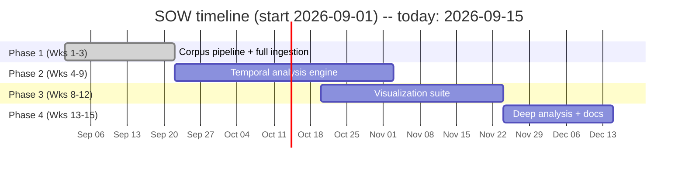
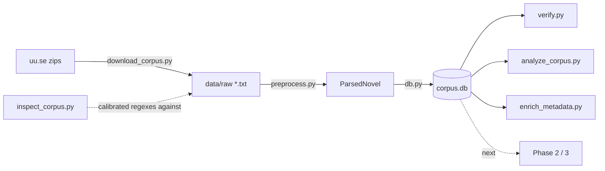
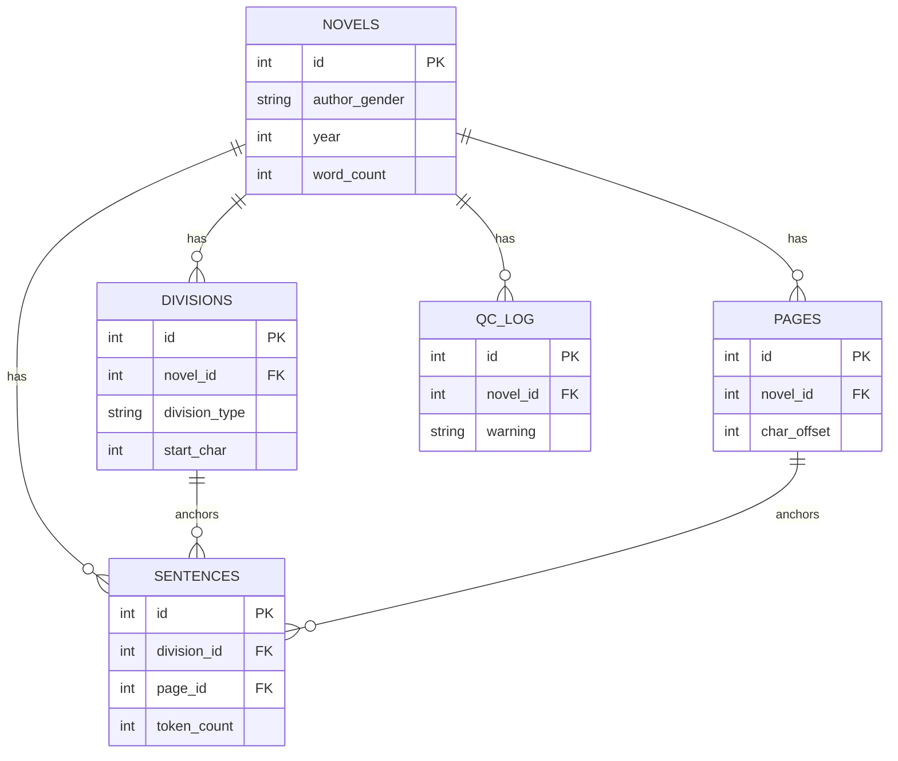
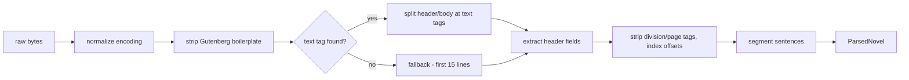
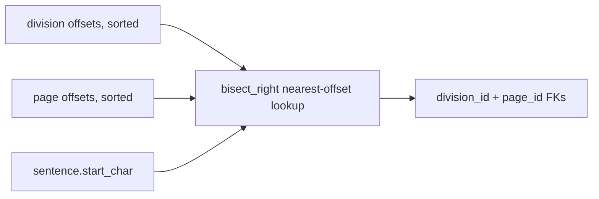
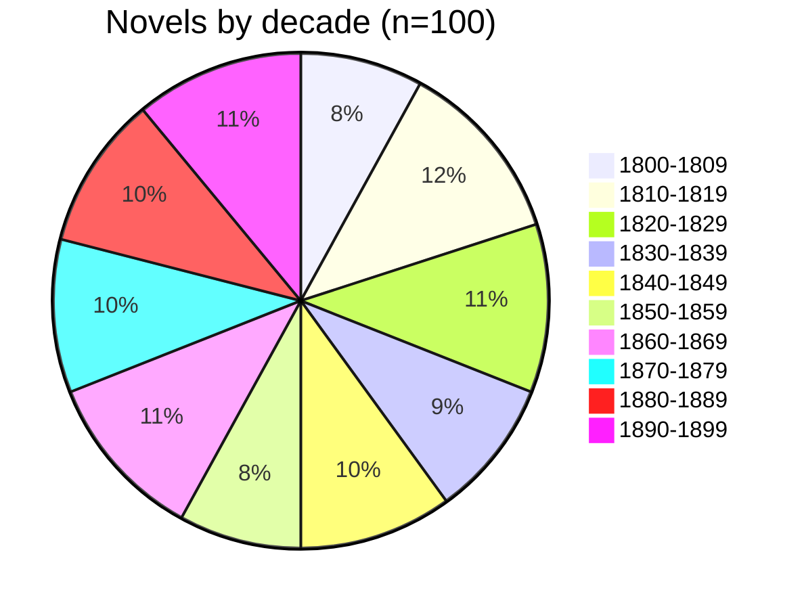
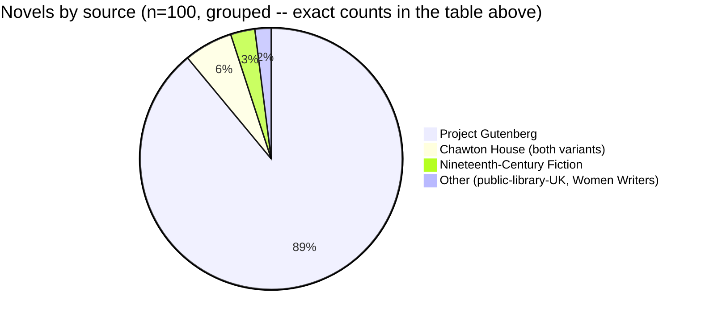
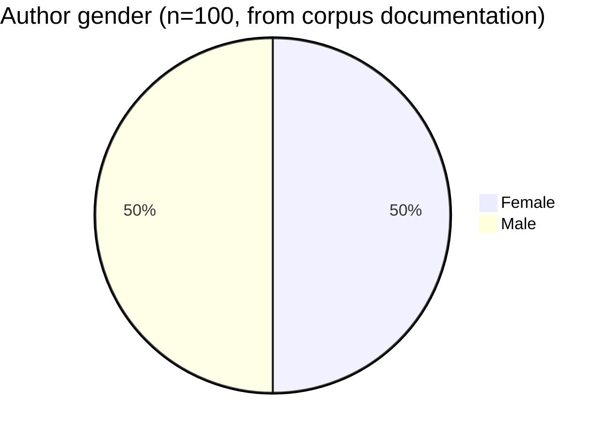

# Weeks 1-2 — Corpus pipeline built, validated against real data, and run on the full 100-novel corpus

**Period:** Weeks 1-2 (2026-09-01 to 2026-09-14); report filed 2026-09-15
**SOW phase:** Phase 1 — Corpus Setup & Data Pipeline (Weeks 1-3, ~40 hrs)

## Summary

Phase 1 is functionally complete and, as of this period, actually validated: the
full 100-novel HUM19UK corpus has been downloaded, parsed, and loaded into
SQLite, with division/page/sentence linkage spot-checked against real text
rather than synthetic fixtures. We also pulled and integrated the corpus's own
bibliographic documentation (a PDF the compilers publish alongside the texts),
which gives us confirmed author gender for all 100 novels (50 F / 50 M,
matching the SOW's claim exactly) and confirms 9 of the 100 "novels" are
actually a single volume of a multi-volume original, not the complete work.
Combined with the page-number gap and the dead corpus URL, that's three
scope-relevant findings worth raising with Shawna — see "Open items" below.

## Timeline

We're 2 weeks into Phase 1's 3-week window and its deliverable is already
done — full 100-novel corpus vs. the 10-novel test slice the SOW requires —
so we're ahead on the work but behind on the QC/scope decisions that
full-corpus visibility surfaced. See "Open items."

## Architecture & Code

### Pipeline data flow

Each box is one script in `src/`; arrows show what feeds what.

`build_pipeline.py` is the CLI that drives B→C→D end to end;
`enrich_metadata.py` backfills author gender/birth-death/volume-note into D
from the corpus's own Contents PDF (see Corpus Data Analysis, below).

### Database schema (key fields only — full schema in `db.py`)

### `preprocess.py` — `parse_novel()` step-by-step

Detail behind each box: **normalize encoding** tries utf-8 → utf-8-sig →
latin-1 and strips a stray BOM; **text tag** splitting uses `<text>...</text>`
as the hard content boundary (this is what discards the OCR errata list
appended after *Dracula*'s `</text>`); **strip tags** is a single pass that
records each division/page tag's offset directly in the cleaned text as it
goes; **segment sentences** uses the trained Punkt English model, not a
blank tokenizer (see "What was done").

### `db.py` — sentence-to-division/page linking

Every sentence gets FK'd to the *nearest preceding* division and page by
character offset (not by index) — a plain join answers "which chapter/page
is this sentence in," which is what Phase 2's multi-granularity comparison
depends on.

## What was done

- **Located the real corpus source.** The SOW's URL
  (`linguisticsathuddersfield.com`) no longer resolves. HUM19UK is now
  mirrored at Uppsala University as 10 decade-by-decade zip files; URLs are
  hardcoded in `src/config.py`.
- **Built the pipeline**: `download_corpus.py` (fetch + extract),
  `preprocess.py` (encoding normalization, header extraction, chapter/page
  tag stripping with offset tracking, sentence segmentation), `db.py`
  (SQLite schema: `novels`, `divisions`, `pages`, `sentences`, `qc_log`),
  `build_pipeline.py` (CLI), `verify.py` (checks deliverables against the
  DB), `inspect_corpus.py` (calibration tool for checking regex patterns
  against real files).
- **First pass was built against assumed formats, not verified ones** —
  the original regexes were modeled on HUM19UK's public documentation
  (TEI-lite-style `
`, `<pb n="47"/>`), because the
  first attempt couldn't reach uu.se to check. That environment limitation
  didn't hold on closer inspection — uu.se is reachable — so before trusting
  any of it, downloaded real decade zips and diffed the assumptions against
  actual files.
- **Real format differs from every assumption**, and the parser was rewritten
  to match what's actually there:
  - Header block: `<Title: ...>`, `<Publication date: ...>` (also seen:
    `Date of publication`, and a `Publication data` typo), `<Page numbers:
    yes|no>`, `<Source: ...>` — not the bare `Title: ...`/`Year:` format
    assumed originally.
  - Per-novel `Gender` field is essentially absent from the header (only 1
    of 100 novels has it inline — see the Corpus Data Analysis section).
    HUM19UK records author gender mainly in a separate `Description of
    Contents Corpus.zip` PDF, not per novel. `author_gender` being `None`
    for 99/100 novels is accurate, not a bug.
  - Chapter/volume markers: `
` / `<chapter
    title="...">` (occasionally `<div="...">` with no `title` keyword) —
    not the TEI `type=`/`n=` attribute form assumed originally.
  - Page markers: two different conventions that correlate with the
    source library — bare `<3>` for Chawton House Collection texts,
    `<Page 3 >` for public-library-UK texts.
  - `<text>...</text>` reliably bounds the real novel body in every file
    checked. Using it as a hard split point fixed a real bug: at least one
    Gutenberg-sourced file (*Dracula*, 1897) has an OCR errata/corrections
    list appended after `</text>` that would otherwise have been ingested
    as narrative sentences.
- **Fixed a sentence-segmentation bug**: the tokenizer was being
  instantiated with no trained model (`PunktSentenceTokenizer()` with no
  arguments), which mis-splits on ordinary abbreviations — "Mr. Smith went
  to Washington." was coming out as two sentences. Switched to loading the
  trained English model, matching what NLTK's own `sent_tokenize()` does
  internally. Verified against real prose post-fix.
- **Rewrote the test fixtures** in `tests/test_preprocess.py` — they were
  built against the fictional TEI format and would have kept passing while
  silently testing the wrong thing. Fixtures now mirror the verified real
  format. All 7 tests pass.
- **Downloaded and ingested the full corpus** (all 10 decade zips, 100
  files) — not just the 10-novel test slice the SOW deliverable calls for.
- **Built `src/analyze_corpus.py`** and ran a full descriptive analysis of
  the ingested corpus at Shawna's request — see "Corpus Data Analysis"
  below for the full breakdown (full-corpus totals, per-novel
  distributions, decade/source trends, and structural/data-quality
  outliers).

## Decisions made

- **Used `<text>...</text>` as the primary content boundary** rather than
  trying to pattern-match front/back matter directly. Reasoning: it's the
  one marker that was 100% consistent across every sampled file (exactly
  one `<text>` and one `</text>` per file, across 3 decades / 24 files
  checked before trusting it at full-corpus scale), and it's more robust
  than guessing at title-page/copyright boilerplate patterns that vary by
  source library.
- **Left a category of bracket-wrapped apparatus text unfixed for now.**
  Some files wrap non-structural content — title restatements, prefaces,
  inline footnote/glossary cross-references — in the same bare `<...>`
  bracket style used elsewhere, with no distinguishing attribute. Stripping
  these generically risks either leaving real footnote noise in or deleting
  real narrative content that happens to contain a quotation mark (chapter
  titles like `<chapter title="XIX. MONTGOMERY'S "BANK HOLIDAY.">` show
  this isn't always cleanly delimited). This doesn't corrupt the
  division/page/sentence offset linking that Phase 1 deliverables depend
  on — it's a content-cleanliness issue affecting a minority of sentences,
  not a structural one. Flagging for a decision rather than guessing.
- **Malformed page tags with no number (`<Page >`) are left unmatched
  rather than assigned a placeholder.** There's no number to record; a
  placeholder would be worse than a small gap.

## Current state vs. SOW (Phase 1)

| Duty / deliverable | Status |
|---|---|
| Download HUM19UK corpus | Done — all 10 decades, 100 files |
| Encoding normalization (UTF-8) | Done |
| Chapter/section splitting | Done, verified against real files (98/100 novels have detected divisions) |
| Removal of front/back matter | Mostly done (`<text>` boundary strips header + trailing errata); residual bracket-wrapped apparatus noise in some sentences — open item above |
| Tokenization / sentence segmentation | Done, using the trained model |
| Structured, queryable storage (SQLite) | Done — `novels`/`divisions`/`pages`/`sentences`/`qc_log`, FK-linked |
| Clean and verify ≥10 test novels | Done — exceeded: all 100 ingested and pass `verify.py` |
| Working corpus directory with 10+ preprocessed novels | Done |
| Data pipeline code (documented) | Done |
| SQLite database with corpus metadata and text | Done |

Full-corpus numbers (`python -m src.build_pipeline` + `python -m src.verify`,
2026-09-15): 100 novels ingested, 0 parse errors, 13,264,045 words total
(SOW estimate: ~13M — matches), 602,862 sentences, 3,985 divisions, 2,092
page markers.

## Findings / deviations from the SOW

1. **Corpus URL is dead.** `linguisticsathuddersfield.com` no longer serves
   the files; using Uppsala's mirror instead (URLs in `config.py`).
2. **"Page numbers included" does not hold corpus-wide.** Only 9 of 100
   novels have any original page-number markers at all — concentrated in
   1800s-1850s texts sourced from Chawton House Collection or
   public-library-UK editions. Every Gutenberg-sourced novel (the majority
   of the corpus, and all of it from the 1860s onward in the files checked)
   explicitly declares `Page numbers: no` in its own header and carries none.
   This is a corpus fact, not a parsing gap — `inspect_corpus.py` and manual
   grep confirm the source files themselves have no page markers to detect.
3. **RESOLVED — per-novel author-gender field is essentially absent from the
   text files themselves (1/100 has it inline), but the corpus's own
   "HUM19UK Corpus Contents" PDF has it for all 100.** That PDF is a
   complete bibliographic index the corpus creators publish alongside the
   text files — year, author, gender, birth/death years, title, source,
   and notes for every novel. Built `src/enrich_metadata.py` to parse it
   (PyPDF2 text extraction, no OCR needed — it's a real text layer) and
   backfill `author_gender`, `author_birth_year`, `author_death_year`, and
   `volume_note` into the database, matched to our 100 novels by
   normalized title similarity (100/100 matched automatically). Result:
   **exactly 50 female / 50 male**, confirming the SOW's claim precisely.
   Full breakdown in "Author & volume metadata" below.
4. **2 of 100 novels have no chapter/volume divisions at all**
   (`1817.txt`, `1835.txt`) — confirmed by manual inspection, not a
   detection failure; these texts are genuinely undivided single-block
   narratives in the source.
5. **9 of 100 novels are confirmed by the corpus's own documentation to be
   one volume of a multi-volume original, not the complete work** (not 10
   — see below). This is a more significant deviation from the SOW's "100
   complete novels" framing than the page-number gap: a temporal-pacing
   analysis run on volume 1 of 5 will see an artificially truncated story
   arc, since the rest of the novel isn't in this corpus at all. The same
   Contents PDF that resolved the gender question also carries an explicit
   note wherever this is true (e.g. "Volume I only"), which is how this
   went from "10, guessed from titles" to "9, confirmed by the compilers" —
   full reconciliation in "Author & volume metadata" below.
6. **2 of 100 novels have a header year that disagrees with their filename
   / decade-folder placement**: `1814.txt` (filed under 1810-1819) has
   `Publication date: 1813` in its own header; `1860.txt` (filed under
   1860-1869) has `Publication Date: 1869`. Both are compiler data-entry
   errors in the source files, not a parsing artifact — confirmed by
   reading the raw header lines directly. Doesn't affect decade grouping
   (we use the folder decade, not a derived one) but does mean the `year`
   column can't be blindly trusted for fine-grained (non-decade)
   chronological analysis without a spot-check.

## Corpus Data Analysis

Shawna asked for a full analysis of what the pipeline has captured so far.
Ran via two scripts against the full 100-novel database built this period:
`src/analyze_corpus.py` (structural/statistical analysis --
`python -m src.analyze_corpus --deep --csv reports/data/novel_stats.csv`)
and `src/enrich_metadata.py` (backfills real author gender/birth-death/
volume-completeness data from the corpus's own documentation -- see
"Author & volume metadata" below). Full per-novel data, including the
enriched columns, is in [`reports/data/novel_stats.csv`](data/novel_stats.csv).

### Full-corpus totals

| Metric | Value |
|---|---|
| Novels | 100 |
| Total words | 13,264,045 (SOW estimate: ~13M — matches) |
| Total sentences | 602,862 |
| Total divisions (chapters + volumes) | 3,985 |
| Total original page markers | 2,092 (across 9 novels, 6 reliably — see below) |
| Unique credited authors | 100 (no author appears twice in the corpus) |
| Author gender | 50 F / 50 M (SOW claim confirmed exactly — see below) |
| Complete novels vs. single-volume extracts | 91 complete / 9 volume-only (see below) |

### Per-novel distributions

| Measure | Min | Median | Mean | Max | Stdev |
|---|---|---|---|---|---|
| Words/novel | 12,608 | 136,898 | 132,641 | 349,153 | 75,289 |
| Sentences/novel | 354 | 5,706 | 6,029 | 22,170 | 4,198 |
| Chapters/novel | 0 | 37.5 | 38.8 | 100 | 23.0 |
| Avg words/sentence (per novel) | 13.0 | 23.1 | 26.1 | 128.1 | 13.5 |

The word-count spread is wide (12.6K to 349K words) — this is a real mix of
novellas and triple-decker novels, not a parsing artifact (see longest/
shortest lists below, which are all recognizable, correctly-titled works).

### Decade breakdown

| Decade | Novels | Words | Sentences | Novels w/ page markers |
|---|---|---|---|---|
| 1800-1809 | 8 | 851,240 | 28,618 | 3/8 |
| 1810-1819 | 12 | 1,259,254 | 43,789 | 1/12 |
| 1820-1829 | 11 | 1,014,151 | 34,453 | 2/11 |
| 1830-1839 | 9 | 1,126,830 | 46,685 | 0/9 |
| 1840-1849 | 10 | 1,518,054 | 65,054 | 1/10 |
| 1850-1859 | 8 | 1,275,377 | 55,877 | 2/8 |
| 1860-1869 | 11 | 2,025,097 | 94,146 | 0/11 |
| 1870-1879 | 10 | 1,730,869 | 99,475 | 0/10 |
| 1880-1889 | 10 | 1,132,295 | 51,902 | 0/10 |
| 1890-1899 | 11 | 1,330,878 | 82,863 | 0/11 |

Page-marker coverage is entirely a pre-1860 phenomenon in this corpus —
useful to know before scoping any page-anchored Phase 2/3 work (see Open
items).

### Source / provenance mix

| Source | Novels | With page markers |
|---|---|---|
| Project Gutenberg | 88 | 3 |
| Chawton House Collection online | 4 | 3 |
| Nineteenth-Century Fiction (chadwyck.co.uk) | 3 | 2 |
| Chawton House | 2 | 0 |
| public-library-UK | 1 | 1 |
| A Celebration of Women Writers | 1 | 0 |
| Project Gutenberg EBook | 1 | 0 |

88% of the corpus is Gutenberg-sourced, and page markers are almost
entirely a non-Gutenberg phenomenon — confirms the pattern from the decade
breakdown rather than adding a new one.

### Page-marker coverage (all 9 novels with original page numbers)

| Filename | Decade | Source | Page marks | Words/page mark |
|---|---|---|---|---|
| 1805.txt | 1800-1809 | public-library-UK | 934 | 148 |
| 1807.txt | 1800-1809 | Chawton House Collection online | 221 | 551 |
| 1809.txt | 1800-1809 | Chawton House Collection online | 55 | 1,055 |
| 1810.txt | 1810-1819 | Chawton House Collection online | 188 | 542 |
| 1824a.txt | 1820-1829 | Project Gutenberg | 87 | 2,044 |
| 1826.txt | 1820-1829 | Project Gutenberg | 50 | 3,492 |
| 1849a.txt | 1840-1849 | Nineteenth-Century Fiction | 226 | 275 |
| 1850.txt | 1850-1859 | Nineteenth-Century Fiction | 297 | 208 |
| 1853.txt | 1850-1859 | Project Gutenberg | 34 | 2,589 |

The "words/page mark" column (word_count ÷ page_count) reveals these 9
novels aren't a uniform "has real pagination" group. The 3 Gutenberg-sourced
ones (1824a, 1826, 1853) have implausibly sparse marks — 2,000-3,500 words
between marks is 6-10 real printed pages, not 1 — meaning these are likely
incidental page citations (e.g. from an editor's footnote), not systematic
per-page tagging. The 6 non-Gutenberg ones (Chawton House, public-library-UK,
Nineteenth-Century Fiction) sit in a plausible 150-550 words/page range for
actual 19th-century book pagination. Practical upshot: treat page data as
reliable for 6/100 novels, not 9/100 — see Open items.

### Structural & data-quality outliers

- **Zero divisions**: `1817.txt` (*Villasantelle*, Catherine Selden) and
  `1835.txt` (*Shanty the Blacksmith*, Mrs. Sherwood) — genuinely
  undivided in the source (see Findings #4).
- **Longest 5 by word count**: *The Way We Live Now* (Trollope, 1875,
  349K words), *Daniel Deronda* (Eliot, 1876, 309K), *Robert Elsmere*
  (Ward, 1888, 286K), *The Heavenly Twins* (Grand, 1893, 280K), *Lorna
  Doone* (Blackmore, 1869, 274K).
- **Shortest 5 by word count**: *The Vampyre* (Polidori, 1819, 12.6K),
  *Theresa Marchmont* (Gore, 1824, 15.9K), *A Phantom Lover* (Paget, 1886,
  20.3K), *The Missionary vol. I* (Morgan, 1811, 25K), *Alice's Adventures
  in Wonderland* (Carroll, 1865, 26.3K).
- **Extreme sentence-length outlier**: `1819.txt` (*Any Thing But What You
  Expect*, Jane Harvey) averages 128 words/sentence — 5x the corpus median
  — with individual "sentences" up to 1,242 words. Checked this directly:
  it's not an encoding or tokenizer bug (the raw text is valid UTF-8 with
  correctly-encoded curly quotes; a `�` in one of my earlier terminal greps
  was just a Windows console display artifact, not corrupted data). It's a
  real stylistic property of this text — long compound clauses joined by
  semicolons and dialogue tags, with very few sentence-terminating periods
  across long stretches. NLTK's tokenizer only splits on `.`/`!`/`?`, so it
  correctly does not break these up. Worth flagging for Phase 2: any
  sentence-level temporal-granularity analysis will see very different
  "sentence" sizes across the corpus depending on period style, not just
  content.
- **Filename/header year mismatches**: see Findings #6 above.
- **No repeat authors**: all 100 novels have distinct credited authors —
  useful to know since it means author-level aggregation in Phase 2/3 is
  equivalent to novel-level aggregation (no need to handle a multi-novel
  author case yet).

### QC warnings, corpus-wide

| Warning | Count |
|---|---|
| No original page-number markers detected | 91 |
| No chapter/volume divisions detected | 2 |

(No "no title found" or "suspiciously short" warnings fired on any of the
100 novels.)

### Deeper extraction — squeezing what's left out of the downloaded data

Everything below comes from `python -m src.analyze_corpus --deep`, which
reads every novel's full cleaned text (not just the structural counts
above). These are not Phase 2 deliverables — Phase 2 is the actual
tense/temporal-marker/flashback detection engine — but they're free
signal sitting in data we already have, and directly inform two of the
open items below.

### Author & volume metadata (from the corpus's own documentation, not a guess)

The corpus ships a "HUM19UK Corpus Contents" PDF: a complete bibliographic
table (year, author, gender, birth/death years, title, source, notes) for
all 100 novels, published by the compilers themselves. It has a real text
layer (extracted directly with PyPDF2, no OCR needed), and `src/enrich_metadata.py`
parses it and matches every row to a novel in our database by normalized
title similarity — all 100 matched automatically, no manual mapping. This
is a better source than either the per-file headers (1/100 has gender
inline) or a title-text guess (see below), and it's now backfilled into
`novels.author_gender` / `author_birth_year` / `author_death_year` /
`volume_note`.

**Gender — exactly 50/50, matching the SOW's claim precisely:**

**Partial-volume novels — authoritative list (9), reconciled against the
title-text heuristic (10) used before this data was available:**

| Filename | Title | Volume note |
|---|---|---|
| 1814.txt | The Wanderer (Volume 1 of 5) or, Female Difficulties | Volume I only |
| 1820.txt | Melmoth the Wanderer Vol. 1 (of 4) | Volume I only |
| 1822a.txt | The Three Perils of Man, Vol. 1 (of 3) | Volume I only |
| 1828.txt | Penelope: or, Love's Labour Lost, Vol. 2 (of 3) | Volume II only |
| 1839.txt | The Widow Barnaby Vol. I (of 3) | Volume I only |
| 1841.txt | Charles O'Malley, The Irish Dragoon, Vol. 1 (of 2) | Volume I only |
| 1850.txt | The Ladder of Gold: Vol. II | Volume II only |
| 1851.txt | Lavengro: The Scholar, The Gypsy, The Priest | Volume II only |
| 1853.txt | Charles Auchester, Vol. 1 of 2 | Volume I only |

The reconciliation itself is informative: the title-text heuristic used in
the first pass of this analysis **missed 1851.txt** entirely (nothing in
*Lavengro*'s title hints it's volume II only — that fact only exists in
the compilers' documentation) and **falsely flagged 1811a.txt and
1812.txt** (both are confirmed complete despite "vol. I" / "Vol. 1-3" in
their titles — 1812's "Vol. 1-3" turns out to mean "all 3 volumes
combined in one file," not "volume 1 of 3"). Two other titles that look
multi-volume are also confirmed complete: 1874.txt (*Mortomley's Estate*,
"All 3 volumes") and 1881.txt (*John Inglesant*, "All 2 volumes"). Lesson:
title text alone cannot reliably answer "is this the complete novel," and
now we don't have to guess.

**Also surfaced in the same documentation — pseudonyms**, relevant to any
gender-and-publishing angle on this corpus: 1848.txt (Anne Brontë)
published as "Acton Bell," 1867.txt (Marie Louise de la Ramée) as "Ouida,"
1886.txt (Violet Paget) as "Vernon Lee," and 1893a.txt (Frances Clarke) as
"Sarah Grand." All four are recorded correctly as their real, legal gender
in the enriched data even where the published byline obscured it — worth
knowing if any Phase 2/4 analysis ever wants to slice by *how a book was
gendered on its title page* rather than by the author's actual gender.

**Author lifespan** (from birth/death years, now in the database): mean
author age at publication is derivable per-novel (`year - author_birth_year`)
but not yet computed here — flagging as an easy follow-up if Shawna wants
"how old was this author when they wrote this" as a variable, since the
data to compute it is now sitting in the `novels` table.

**Chapter length by decade** (words/chapter — a structural pacing proxy,
no NLP required):

| Decade | Words/chapter |
|---|---|
| 1800-1809 | 4,734 |
| 1810-1819 | 4,470 |
| 1820-1829 | 4,128 |
| 1830-1839 | 4,486 |
| 1840-1849 | 3,856 |
| 1850-1859 | 3,678 |
| 1860-1869 | 3,659 |
| 1870-1879 | 3,245 |
| 1880-1889 | 3,863 |
| 1890-1899 | 3,235 |

**Sentence length by decade** (words/sentence):

| Decade | Words/sentence |
|---|---|
| 1800-1809 | 34.0 |
| 1810-1819 | 39.3 |
| 1820-1829 | 32.5 |
| 1830-1839 | 26.7 |
| 1840-1849 | 25.1 |
| 1850-1859 | 23.3 |
| 1860-1869 | 22.6 |
| 1870-1879 | 19.4 |
| 1880-1889 | 21.5 |
| 1890-1899 | 15.8 |

Both trend the same direction and it's a large effect: chapters shrink
~32% and sentences shrink ~54% from the 1800s to the 1890s. This lines up
with the well-documented shift from Victorian periodic-sentence prose
toward shorter modern sentences, and it's visible directly in structural
data — no tense-tagging or heuristics needed. Worth mentioning to Shawna as
a validated, ready-made "narrative pace over time" finding that doesn't
have to wait for Phase 2.

**Temporal-marker phrase frequency** (SOW's own example phrases, counted
corpus-wide — a feasibility sounding, not a claim this is Phase 2's actual
detector):

| Phrase | Occurrences |
|---|---|
| "meanwhile" | 859 |
| "the next day" | 532 |
| "years ago" | 517 |
| "long ago" | 355 |
| "in the meantime" | 290 |
| "years before" | 187 |
| "the following day" | 149 |
| "days later" | 36 |
| "at dawn" | 26 |
| "at dusk" | 22 |
| "years later" | 21 |
| "months later" | 5 |
| "weeks later" | 2 |
| **Total** | **3,001** |

3,001 hits from just 13 seed phrases across 100 novels is a solid
feasibility signal for Phase 2's explicit-temporal-marker detection —
there's clearly real signal to mine, not a sparse edge case.

**Vocabulary richness** (type-token ratio = unique words / total words;
biased toward shorter novels since TTR mechanically drops as text length
grows, so this is *not* a normalized "simpler vocabulary" measure — treat
it as a length-driven artifact unless renormalized on a fixed-size sample
in a later pass): corpus mean 0.10 (min 0.032, max 0.231). The 5
lowest-TTR novels (1861, 1866, 1838, 1864, 1875) are also 5 of the corpus's
longest novels — confirms the length bias rather than revealing a real
vocabulary difference. Flagging so nobody mistakes this raw number for a
style finding without renormalizing first.

### Full novel-by-novel table

All 100 novels (click to expand) — full data including author
birth/death years and volume notes in
<a href="data/novel_stats.csv">novel_stats.csv</a>

| Filename | Title | Author | Gender | Year | Words | Divisions | Pages | Sentences | Avg words/sentence |
|---|---|---|---|---|---|---|---|---|---|
| 1800.txt | Castle Rackrent | Maria Edgeworth | F | 1800 | 35,640 | 2 | 0 | 841 | 42.4 |
| 1802.txt | Stella of the North, or the Foundling of the Ship | Helen Craik | F | 1802 | 181,141 | 93 | 0 | 4,295 | 42.2 |
| 1803.txt | Thaddeus of Warsaw | Jane Porter | F | 1803 | 177,473 | 45 | 0 | 7,711 | 23.0 |
| 1804.txt | Adeline Mowbray or, The Mother and Daughter | Amelia Alderson Opie | F | 1804 | 106,070 | 29 | 0 | 3,808 | 27.9 |
| 1805.txt | Fleetwood: Or, The New Man Of Feeling | William Godwin | M | 1805 | 137,929 | 57 | 934 | 6,524 | 21.1 |
| 1807.txt | Drelincourt and Rodalvi; or, Memoirs of Two Nobel Families | Elizabeth (Byron) Strutt | F | 1807 | 121,849 | 52 | 221 | 2,456 | 49.6 |
| 1808.txt | The Adventures of Ulysses | Charles Lamb | M | 1808 | 33,142 | 10 | 0 | 874 | 37.9 |
| 1809.txt | THE CORINNA OF ENGLAND. | Anna Maria Mackenzie | F | 1809 | 57,996 | 29 | 55 | 2,109 | 27.5 |
| 1810.txt | Romance Readers and Romance Writers: a Satirical Novel | Sarah Green | F | 1810 | 101,942 | 29 | 188 | 2,647 | 38.5 |
| 1811.txt | Self-control | Mary Brunton | F | 1811 | 184,143 | 34 | 0 | 7,659 | 24.1 |
| 1811a.txt | The Missionary; vol. I. An Indian Tale | Lady Sidney Morgan | F | 1811 | 24,956 | 7 | 0 | 567 | 44.0 |
| 1812.txt | The Loyalists, Vol. 1-3, An Historical Novel | Jane West | F | 1812 | 148,421 | 31 | 0 | 4,882 | 30.4 |
| 1813.txt | PRIDE AND PREJUDICE: A NOVEL. IN THREE VOLUMES. | Jane Austen | F | 1813 | 121,484 | 61 | 0 | 5,975 | 20.3 |
| 1813a.txt | The Heroine | Eaton Stannard Barrett | M | 1813 | 101,259 | 50 | 0 | 6,332 | 16.0 |
| 1814.txt | The Wanderer (Volume 1 of 5) or, Female Difficulties ‡ | Fanny Burney | F | 1813* | 70,423 | 20 | 0 | 2,981 | 23.6 |
| 1816.txt | The Antiquary, Complete | Sir Walter Scott | M | 1816 | 167,350 | 47 | 0 | 3,828 | 43.7 |
| 1817.txt | Villasantelle; or the Curious Impediment | Catherine Selden | F | 1817 | 58,155 | 0 | 0 | 1,315 | 44.2 |
| 1818.txt | Marriage | Susan Edmonstone Ferrier | F | 1818 | 145,201 | 70 | 0 | 6,286 | 23.1 |
| 1819.txt | Any Thing But What You Expect | Jane Harvey | F | 1819 | 123,312 | 29 | 0 | 963 | 128.1† |
| 1819a.txt | The Vampyre; A Tale | John William Polidori | M | 1819 | 12,608 | 1 | 0 | 354 | 35.6 |
| 1820.txt | Melmoth the Wanderer Vol. 1 (of 4) ‡ | Charles Robert Maturin | M | 1820 | 56,002 | 6 | 0 | 1,664 | 33.7 |
| 1822.txt | The Provost | John Galt | M | 1822 | 55,023 | 48 | 0 | 1,045 | 52.6 |
| 1822a.txt | The Three Perils of Man, Vol. 1 (of 3) ‡ | James Hogg | M | 1822 | 63,083 | 13 | 0 | 2,639 | 23.9 |
| 1823.txt | Isabella. A Novel | Frances Jacson | F | 1823 | 152,240 | 59 | 0 | 6,269 | 24.3 |
| 1824.txt | Theresa Marchmont | Mrs Charles Gore | F | 1824 | 15,854 | 4 | 0 | 403 | 39.3 |
| 1824a.txt | The Adventures of Hajji Baba of Ispahan | James Morier | M | 1824 | 177,821 | 81 | 87 | 5,035 | 35.3 |
| 1825.txt | Richelieu, v. 1/3 A Tale of France | G. P. R. James | M | 1825 | 51,547 | 12 | 0 | 1,871 | 27.6 |
| 1826.txt | The Last Man | Mary W. Shelley | F | 1826 | 174,589 | 33 | 50 | 6,897 | 25.3 |
| 1827.txt | The Mummy! | Jane C. Loudon | F | 1827 | 161,007 | 31 | 0 | 5,275 | 30.5 |
| 1827a.txt | The Epicurean | Thomas Moore | M | 1827 | 54,211 | 20 | 0 | 1,459 | 37.2 |
| 1828.txt | Penelope: or, Love's Labour Lost, Vol. 2 (of 3) ‡ | William Pitt Scargill | M | 1828 | 52,774 | 19 | 0 | 1,896 | 27.8 |
| 1830.txt | Paul Clifford, Complete | Edward Bulwer-Lytton | M | 1830 | 172,315 | 35 | 0 | 5,704 | 30.2 |
| 1831.txt | Crotchet Castle | Thomas Love Peacock | M | 1831 | 36,390 | 19 | 0 | 1,993 | 18.3 |
| 1833.txt | Tom Cringle's Log | Michael Scott | M | 1833 | 231,445 | 19 | 0 | 6,001 | 38.6 |
| 1835.txt | Shanty the Blacksmith; A Tale of Other Times | Mrs. Sherwood | F | 1835 | 31,960 | 0 | 0 | 893 | 35.8 |
| 1836.txt | Mr. Midshipman Easy | Captain Frederick Marryat | M | 1836 | 138,303 | 41 | 0 | 6,131 | 22.6 |
| 1836a.txt | Sartor Resartus | Thomas Carlyle | M | 1836 | 77,824 | 36 | 0 | 2,506 | 31.1 |
| 1837.txt | Oliver Twist or the Parish Boy's Progress | Charles Dickens | M | 1837 | 157,205 | 53 | 0 | 9,198 | 17.1 |
| 1838.txt | Deerbrook | Harriet Martineau | F | 1838 | 220,676 | 46 | 0 | 12,097 | 18.2 |
| 1839.txt | The Widow Barnaby Vol. I (of 3) ‡ | Frances Trollope | F | 1839 | 60,712 | 18 | 0 | 2,162 | 28.1 |
| 1840.txt | Tippoo Sultaun: A tale of the Mysore war | Meadows Taylor | M | 1840 | 203,641 | 49 | 0 | 6,711 | 30.4 |
| 1841.txt | Charles O'Malley, The Irish Dragoon, Vol. 1 (of 2) ‡ | Charles Lever | M | 1841 | 169,556 | 68 | 0 | 5,708 | 29.7 |
| 1842.txt | Windsor Castle | William Harrison Ainsworth | M | 1842 | 115,420 | 59 | 0 | 4,624 | 25.0 |
| 1844.txt | Barry Lyndon | William Makepeace Thackeray | M | 1844 | 125,532 | 19 | 0 | 3,724 | 33.7 |
| 1845.txt | Sybil or the Two Nations | Benjamin Disraeli | M | 1845 | 157,801 | 77 | 0 | 6,157 | 25.6 |
| 1846.txt | Wagner, the Wehr-Wolf | George W. M. Reynolds | M | 1846 | 188,654 | 67 | 0 | 7,290 | 25.9 |
| 1847.txt | Wuthering Heights | Emily Bronte | F | 1847 | 115,848 | 34 | 0 | 6,816 | 17.0 |
| 1848.txt | The Tenant of Wildfell Hall | Anne Bronte | F | 1848 | 165,532 | 53 | 0 | 7,188 | 23.0 |
| 1849.txt | Shirley | Charlotte Brontë | F | 1849 | 213,940 | 37 | 0 | 14,481 | 14.8 |
| 1849a.txt | The Nemesis of Faith | J. A. Froude | M | 1849 | 62,130 | 11 | 226 | 2,355 | 26.4 |
| 1850.txt | The Ladder of Gold: Vol. II ‡ | Robert Bell | M | 1850 | 61,710 | 16 | 297 | 3,068 | 20.1 |
| 1851.txt | Lavengro: The Scholar, The Gypsy, The Priest ‡ | George Borrow | M | 1851 | 219,601 | 100 | 0 | 6,281 | 35.0 |
| 1853.txt | Charles Auchester, Vol. 1 of 2 ‡ | Elizabeth Sheppard | F | 1853 | 88,021 | 31 | 34 | 4,585 | 19.2 |
| 1855.txt | Westward Ho! | Charles Kingsley | M | 1855 | 251,349 | 33 | 0 | 8,287 | 30.3 |
| 1855a.txt | Rachel Gray | Julia Kavanagh | F | 1855 | 48,511 | 22 | 0 | 2,817 | 17.2 |
| 1856.txt | It Is Never Too Late to Mend | Charles Reade | M | 1856 | 257,327 | 85 | 0 | 13,160 | 19.6 |
| 1857.txt | John Halifax, Gentleman | Dinah Maria Mulock Craik | F | 1857 | 174,674 | 40 | 0 | 12,021 | 14.5 |
| 1858.txt | Ask Mamma or The Richest Commoner In England | R. S. Surtees | M | 1858 | 174,184 | 63 | 0 | 5,658 | 30.8 |
| 1861.txt | East Lynne | Mrs Henry Wood | F | 1861 | 206,431 | 47 | 0 | 11,228 | 18.4 |
| 1861a.txt | Tom Brown at Oxford | Thomas Hughes | M | 1861 | 246,865 | 51 | 0 | 12,686 | 19.5 |
| 1862.txt | Lady Audley's Secret | Mary Elizabeth Braddon | F | 1862 | 148,780 | 41 | 0 | 7,344 | 20.3 |
| 1863.txt | The House by the Church-Yard | Joseph Sheridan Le Fanu | M | 1863 | 133,297 | 79 | 0 | 5,812 | 22.9 |
| 1864.txt | Wives and Daughters: An Every-day Story | Elizabeth Cleghorn Gaskell | F | 1864 | 269,443 | 60 | 0 | 14,375 | 18.7 |
| 1865.txt | Alice's Adventures in Wonderland | Lewis Carroll | M | 1865 | 26,331 | 12 | 0 | 965 | 27.3 |
| 1866.txt | Miss Marjoribanks | Margeret Oliphant | F | 1866 | 205,610 | 52 | 0 | 7,476 | 27.5 |
| 1867.txt | Under Two Flags | Ouida [Louise de la Ramee] | F | 1867 | 240,827 | 38 | 0 | 8,293 | 29.0 |
| 1868.txt | The Moonstone | Wilkie Collins | M | 1868 | 193,394 | 69 | 0 | 11,997 | 16.1 |
| 1860.txt | Semi-Attached Couple | Emily Eden | F | 1869* | 80,485 | 48 | 0 | 3,716 | 21.7 |
| 1869.txt | Lorna Doone | Richard Doddrige Blackmore | M | 1869 | 273,634 | 75 | 0 | 10,254 | 26.7 |
| 1870.txt | Red as a Rose is She | Rhoda Broughton | F | 1870 | 135,866 | 42 | 0 | 7,452 | 18.2 |
| 1871.txt | Joshua Marvel | Benjamin Leopold Farjeon | M | 1871 | 193,697 | 42 | 0 | 11,682 | 16.6 |
| 1872.txt | The True Story of Joshua Davidson | Elizabeth Lynn Linton | F | 1872 | 38,310 | 13 | 0 | 1,523 | 25.2 |
| 1873.txt | Old Kensington | Anne Thackeray Ritchie | F | 1873 | 153,067 | 56 | 0 | 9,250 | 16.6 |
| 1873a.txt | In the Days of My Youth | Amelia Ann Blandford Edwards | F | 1873 | 148,062 | 56 | 0 | 9,513 | 15.6 |
| 1874.txt | Mortomley's Estate | Charlotte Elizabeth Riddell | F | 1874 | 156,556 | 47 | 0 | 7,163 | 21.9 |
| 1875.txt | The Way We Live Now | Anthony Trollope | M | 1875 | 349,153 | 100 | 0 | 22,170 | 15.8 |
| 1876.txt | Daniel Deronda | George Eliot | F | 1876 | 308,916 | 78 | 0 | 14,279 | 21.6 |
| 1877.txt | Black Beauty | Anna Sewell | F | 1877 | 59,811 | 53 | 0 | 1,989 | 30.1 |
| 1879.txt | The Egoist: A Comedy in Narrative | George Meredith | M | 1879 | 187,431 | 51 | 0 | 14,454 | 13.0 |
| 1881.txt | John Inglesant: A Romance | John Henry Shorthouse | M | 1881 | 186,662 | 39 | 0 | 6,106 | 30.6 |
| 1882.txt | Vice Versa or A Lesson to Fathers | Thomas Anstey Guthrie | M | 1882 | 93,628 | 19 | 0 | 5,227 | 17.9 |
| 1883.txt | The Story of an African Farm | Olive Schreiner | F | 1883 | 101,337 | 29 | 0 | 5,541 | 18.3 |
| 1883a.txt | Treasure Island | Robert Louis Stevenson | M | 1883 | 67,874 | 40 | 0 | 3,736 | 18.2 |
| 1884.txt | We Two | Edna Lyall | F | 1884 | 170,039 | 42 | 0 | 7,198 | 23.6 |
| 1885.txt | King Solomon's Mines | Henry Rider Haggard | M | 1885 | 82,038 | 20 | 0 | 4,139 | 19.8 |
| 1886.txt | A Phantom Lover | Violet Lee Paget | F | 1886 | 20,257 | 10 | 0 | 904 | 22.4 |
| 1886a.txt | Little Lord Fauntleroy | Frances Hodgson Burnett | F | 1886 | 58,328 | 15 | 0 | 2,561 | 22.8 |
| 1888.txt | Robert Elsmere | Mary Augusta Ward | F | 1888 | 285,586 | 51 | 0 | 13,171 | 21.7 |
| 1889.txt | Three Men in a Boat | Jerome K. Jerome | M | 1889 | 66,546 | 19 | 0 | 3,319 | 20.1 |
| 1890.txt | The Sign of the Four | Sir Arthur Conan Doyle | M | 1890 | 42,996 | 12 | 0 | 2,923 | 14.7 |
| 1891.txt | New Grub Street | George Gissing | M | 1891 | 185,603 | 42 | 0 | 13,432 | 13.8 |
| 1892.txt | The Diary of a Nobody | George & Weedon Grossmith | M | 1892 | 41,912 | 24 | 0 | 2,537 | 16.5 |
| 1893.txt | Miss Stuart's Legacy | Flora Annie Steel | F | 1893 | 106,038 | 27 | 0 | 6,169 | 17.2 |
| 1893a.txt | The Heavenly Twins | Sarah Grand | F | 1893 | 280,286 | 97 | 0 | 14,639 | 19.1 |
| 1894.txt | The Daughters of Danaus | Mona Caird | F | 1894 | 156,287 | 51 | 0 | 10,223 | 15.3 |
| 1894a.txt | The Prisoner of Zenda | Anthony Hope | M | 1894 | 53,455 | 22 | 0 | 3,898 | 13.7 |
| 1895.txt | Jude the Obscure | Thomas Hardy | M | 1895 | 144,028 | 59 | 0 | 9,297 | 15.5 |
| 1896.txt | The Island of Doctor Moreau | Herbert George Wells | M | 1896 | 43,361 | 23 | 0 | 2,879 | 15.1 |
| 1897.txt | Dracula | Bram Stoker | M | 1897 | 160,240 | 27 | 0 | 8,607 | 18.6 |
| 1899.txt | Red Pottage | Mary Cholmondeley | F | 1899 | 116,672 | 54 | 0 | 8,259 | 14.1 |

\* Header year disagrees with filename/decade-folder placement — see
Findings #6. † Extreme sentence-length outlier — see above, this is a
prose-style artifact, not a bug. ‡ Confirmed by the corpus's own
documentation to be one volume of a multi-volume original, not the
complete novel — see Findings #5 and "Author & volume metadata" below
(note: this list is the authoritative one, and differs slightly from a
title-text guess — e.g. it also includes 1851.txt, whose title gives no
hint at all that it's volume II only).

## Open items / needs supervisor input

- **Multi-volume novels.** Confirmed by the corpus's own documentation
  (not a guess — see "Author & volume metadata"): 9 of 100 files are one
  volume of a multi-volume original, not the complete novel. This
  directly affects Phase 2/4: a temporal-pacing or flashback analysis on
  "volume 1 of 5" will see a story arc that's artificially cut off
  mid-novel. Needs a decision: exclude these 9 from Phase 2/4's analysis
  set, try to source and stitch together the missing volumes (extra
  scope, may not be feasible in-corpus), or accept and caveat the
  limitation in the methodology write-up. This is a bigger deal than it
  looks and probably the single most important item to raise next check-in.
- **Page-level visualization scope.** Narrower than it looked two weeks
  ago: only 6 of 100 novels (not 9 — see the words/page-mark analysis
  above) have page markers dense enough to plausibly represent real
  printed pagination; the other 3 "paginated" novels have sparse,
  editorial-footnote-style marks 6-10x too far apart to be real page
  breaks. With reliable page data this thin, and word-count-per-page
  varying 148 to 3,492 even within the reliable subset, a single
  synthetic "words-per-page" fallback constant isn't defensible. Worth
  confirming with Shawna whether page-anchored visualization should be
  scoped to the 6-novel reliable subset, dropped in favor of
  division/sentence-level granularity (available for ~98-100% of the
  corpus), or something else — this is more clearly her call now than it
  was before this analysis.
- **Bracket-wrapped apparatus text** (prefaces, footnotes, title
  restatements) — decide whether to attempt stripping it, accept it as
  minor noise, or treat as a corpus-wide QC pass for a later phase.

~~Corpus gender data~~ — **resolved this period**, no longer open: the
corpus's own Contents PDF has it for all 100 novels (50 F / 50 M), backfilled
via `enrich_metadata.py`. Included here only so it's visible that it moved
from "open" to "closed" this period, not because it still needs a decision.

## Next steps

- Move into Phase 2 (temporal analysis engine) per the SOW timeline, or
  spend remaining Phase 1 buffer time on the bracket-noise cleanup —
  pending direction from the items above.
- Bring the open items (multi-volume novels, page-number scope) to the
  next check-in rather than assuming an answer.
- Re-run `python -m src.analyze_corpus --deep` after any future re-ingest
  to keep `reports/data/novel_stats.csv` and this report's numbers in sync
  with the database. If `build_pipeline.py` is ever re-run, re-run
  `python -m src.enrich_metadata` afterward too (re-ingesting resets the
  enriched columns — see `build_pipeline.py`'s docstring).
