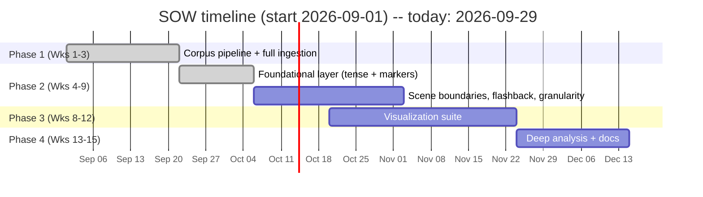
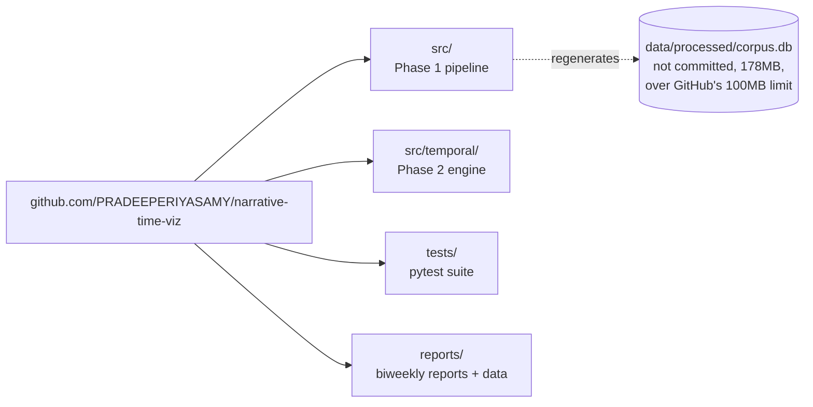
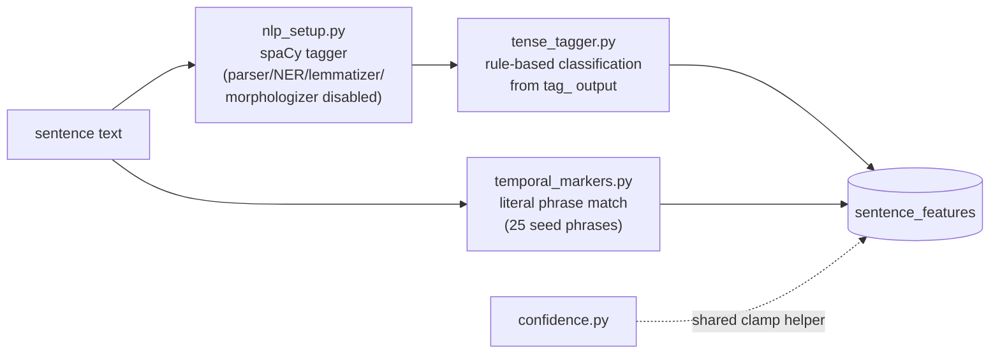
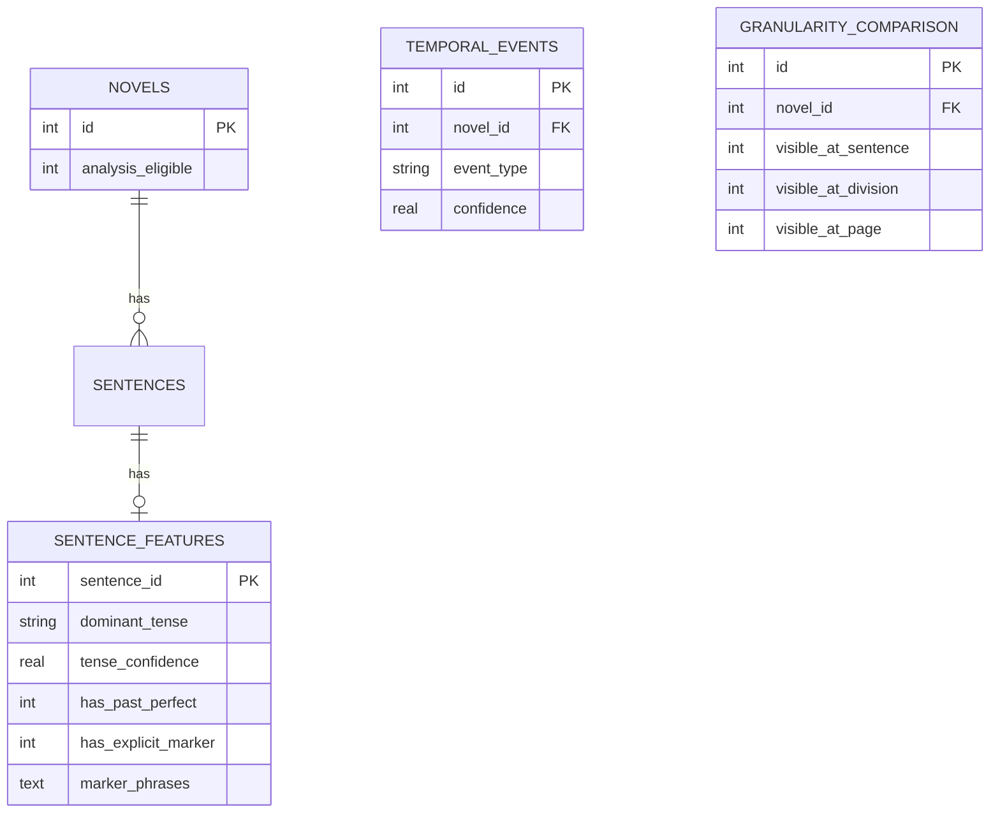

# Weeks 3-4 — Repository published; Phase 2 foundational layer (tense tagging + explicit markers) built and tested

**Period:** Weeks 3-4 (2026-09-15 to 2026-09-28); report filed 2026-09-29
**SOW phase:** Phase 1 close-out (Week 3) into Phase 2 — Temporal Analysis Engine (Weeks 4-9, ~100 hrs)

## Summary

Two workstreams this period. First, the Phase 1 codebase went from a local
working directory to a real, reviewable GitHub repository — 13 commits
organized by module, an accurate README, and a considered call on keeping
the 178MB `corpus.db` out of version control since it's fully regenerable
from committed code. Second, Phase 2 started: before writing any detection
logic, verified two assumptions that could have invalidated the whole
approach (whether scene-break formatting survives Phase 1's text cleaning,
and whether spaCy's tag output actually matches the tense rules a
heuristic engine needs), then built and unit-tested the foundational layer
the rest of Phase 2 depends on — tense classification and explicit
temporal-marker detection. That's a deliberate first slice of a 6-week
phase: everything downstream (scene boundaries, flashback/flash-forward,
cross-granularity comparison) reads sentence-level tense and marker data
as its input, so it needs to exist and be trustworthy first.

## Timeline

Phase 1 closed out in its 3-week window. Phase 2's first two weeks (of six)
delivered the foundational layer; scene boundaries, flashback/flash-forward
detection, and granularity comparison are scoped for weeks 5-9, building on
top of what's here now.

## Architecture & Code

### Repository structure and commit history

13 commits, organized by module rather than by day, so the history reads as
a build-up of the pipeline rather than a diary:

| # | Commit | What it added |
|---|---|---|
| 1 | `chore: project scaffolding, gitignore, dependencies` | `.gitignore`, `requirements.txt` |
| 2 | `feat: corpus config with corrected HUM19UK download URLs` | `src/config.py` |
| 3 | `feat: corpus downloader for the 10 HUM19UK decade zips` | `src/download_corpus.py` |
| 4 | `feat: core Phase 1 preprocessing pipeline` | `src/preprocess.py` |
| 5 | `feat: SQLite schema and insert layer` | `src/db.py`, `src/__init__.py` |
| 6 | `feat: CLI pipeline entrypoint and Phase 1 acceptance checks` | `src/build_pipeline.py`, `src/verify.py` |
| 7 | `feat: corpus inspection tool for regex calibration` | `src/inspect_corpus.py` |
| 8 | `test: unit tests for preprocessing against real-format fixtures` | `tests/` |
| 9 | `docs: rewrite README to reflect verified Phase 1 state` | `README.md` |
| 10 | `feat: corpus-wide and per-novel descriptive analysis` | `src/analyze_corpus.py` |
| 11 | `feat: backfill author gender/birth-death/volume-completeness from corpus docs` | `src/enrich_metadata.py` |
| 12 | `docs: biweekly progress report for Weeks 1-2` | `reports/weeks-01-02.md`, `reports/data/` |
| 13 | `chore: keep corpus.db out of git` | `.gitignore` |

`corpus.db` stays out of git and gets rebuilt locally via
`download_corpus.py` + `build_pipeline.py` + `enrich_metadata.py` — all
three are committed, so the database is a build artifact, not a source
file. This period's Phase 2 work (`src/temporal/`, schema additions,
`tests/test_temporal.py`) is written and verified but not yet committed —
next natural commit once this report is reviewed.

### Phase 2 pipeline: sentence text to tagged features

### Database schema additions

`analysis_eligible` is 0 for the 9 confirmed single-volume novels (see
"Corpus verification for Phase 2" below). `temporal_events` and
`granularity_comparison` are scoped for the scene-boundary/flashback work
in weeks 5-9; their schema is in place now so that work slots in without a
migration later.

### Tense classification rules (`tense_tagger.py`)

Verified directly against spaCy 3.8 / `en_core_web_sm` tag output before
writing these rules, since the parser is disabled for speed and there's no
dependency tree to lean on:

| Construction | spaCy tags | Dominant tense |
|---|---|---|
| `walked` | VBD | past_simple |
| `had walked` | VBD("had") + VBN("walked") | past_perfect |
| `walks` | VBZ | present |
| `has walked` | VBZ("has") + VBN("walked") | present_perfect |
| `would walk` | MD("would") + VB("walk") | future_in_past |
| (no verb found) | — | other |

Confidence: 1.0 if exactly one pattern matches a sentence, 0.6 if more than
one does (an ambiguous verb chain), 0.3 if no verb is found at all (a
fragment or bare dialogue tag like "Eh!").

One construction needed more than the obvious adjacent-token check: **"she
would *later* walk to the market"** doesn't tag as future-in-past under a
strict "would immediately followed by a bare verb" rule, because "later"
(an adverb) sits between them. With the parser disabled there's no
dependency head to follow directly, so the fix uses a bounded 3-token
lookahead from "would"/"had"/"has" to their target verb form instead of
requiring adjacency — confirmed against both the adjacent and
adverb-separated forms in the unit tests below.

### Explicit temporal-marker phrases (`temporal_markers.py`)

| Phrase | Status |
|---|---|
| years later, months later, days later, weeks later | validated — Phase 1 corpus analysis |
| at dawn, at dusk | validated |
| in the meantime, meanwhile | validated |
| the following day, the next day | validated |
| years before, long ago, years ago | validated |
| that same day, not long after, some time later | not yet run against this corpus |
| by now, until now, from then on, ever since | not yet run against this corpus |
| in those days, it was not until, before long | not yet run against this corpus |
| all at once, suddenly | not yet run against this corpus |

The 13 "validated" phrases were already confirmed against the full corpus
during Phase 1's analysis (`reports/weeks-01-02.md`): 3,001 combined hits
across all 100 novels, "meanwhile" alone accounting for 859. The other 12
extend the seed list for Phase 2 but haven't been run against real text
yet — that happens once `temporal_markers.py` is wired into a corpus-wide
pass in the coming weeks.

### Test coverage (`tests/test_temporal.py`)

| Test | Verifies |
|---|---|
| `test_tense_past_simple` | plain past-tense verb -> past_simple, confidence 1.0 |
| `test_tense_past_perfect` | had + VBN -> past_perfect, has_past_perfect flag set |
| `test_tense_present` | present-tense verb -> present |
| `test_tense_present_perfect` | has/have + VBN -> present_perfect |
| `test_tense_future_in_past` | would + (adverb) + VB -> future_in_past (the adjacency-fix case) |
| `test_tense_other_for_fragment` | no verb at all -> other, confidence 0.3 |
| `test_temporal_markers_found` | a known seed phrase is detected in a sentence |
| `test_temporal_markers_none` | a sentence with no marker phrase returns no matches |

Uses the real spaCy model rather than a mock, since the rules are verified
against its actual tag output, not an idealized version of it — a mock
would hide exactly the kind of gap the adverb-separation case exposed.

## What was done

- **Published the repository**: [github.com/PRADEEPERIYASAMY/narrative-time-viz](https://github.com/PRADEEPERIYASAMY/narrative-time-viz).
  See the commit table above for the full breakdown. Rewrote `README.md`
  to describe the verified Phase 1 state accurately (real file format,
  full 100-novel ingest, the analysis/enrichment scripts) rather than the
  pre-verification draft it started as.
- **Verified two assumptions before writing Phase 2 code**, since both
  could have invalidated the approach if wrong:
  1. *Does scene-break formatting survive Phase 1's text cleaning?*
     `preprocess.py` collapses runs of 3+ newlines, which raised the
     question of whether blank-line or `* * *`-style scene breaks (a
     later Phase 2 duty) had been silently destroyed. Checked
     systematically across the full corpus rather than assumed — see
     "Corpus verification for Phase 2" below for the complete count.
     Blank-line runs turned out, in every instance inspected, to be
     chapter-tag whitespace or verse/poem formatting, not a real
     within-chapter convention. The `* * * * *`-style asterisk break,
     however, is real, common, and confirmed to survive cleaning intact.
  2. *Does spaCy's tagger actually produce the tags a rule-based tense
     classifier needs?* Installed spaCy and `en_core_web_sm`, then checked
     its output against 5 hand-written sentences covering each tense
     category before writing a single rule against it — all 5 matched
     the expected tag pattern exactly.
- **Built and unit-tested the Phase 2 foundational layer** — see
  "Architecture & Code" above for the full rule/phrase/test tables:
  `tense_tagger.py`, `temporal_markers.py`, `confidence.py`, schema
  additions in `db.py`, and 8 new unit tests.
- **`enrich_metadata.py` now also sets `analysis_eligible`** for the 9
  novels the Phase 1 report confirmed are a single volume of a
  multi-volume original — a derived flag keyed off the exact
  `"Volume [I/II/...] only"` phrasing in the corpus's own documentation,
  not a hardcoded filename list, so it never drifts out of sync with a
  future re-ingest. Re-verified this period after re-running the
  enrichment step: still exactly 91 eligible / 9 excluded (full list
  below).
- **Benchmarked the spaCy configuration** before settling on it — see
  "Corpus verification for Phase 2" below for the numbers. Disabled the
  morphologizer pipeline component (`tense_tagger.py`'s rules only ever
  read `tag_`, never `morph`, so it was pure unused overhead) and tested
  spaCy's multiprocessing option, which turned out to be slower for
  sentence-length texts rather than faster.

## Decisions made

- **Left `corpus.db` out of git.** It's 178.7MB — over GitHub's 100MB hard
  push limit — and rebuilds cleanly and deterministically from committed
  code. Git LFS was available but would spend a meaningful share of the
  account's free storage quota on a regenerable file for no real benefit.
- **Scoped Phase 2's first two weeks to the foundational layer only**
  (tense tagging, explicit markers, the confidence-scoring helper, and the
  schema the rest of Phase 2 will write into) rather than starting on
  scene-boundary or flashback detection in parallel. Those detectors both
  consume tense/marker data as input, so validating that layer first is
  the right build order for a 6-week phase, not just a pacing convenience.
- **Excluded the 9 single-volume novels by a derived flag, not a
  hardcoded list.** `analysis_eligible` is computed from the exact
  `"Volume N only"` phrasing in the corpus's own documentation. A broader
  "any novel with a note is excluded" rule was considered and rejected: 8
  of the 17 novels that carry *some* note (pseudonyms, co-authored works,
  "all volumes present") are genuinely complete, and a blanket rule would
  have wrongly dropped them from analysis.
- **Kept spaCy single-process.** 8 CPU cores are available, so
  multiprocessing looked like free speed — measured instead of assumed,
  and it was slower (see benchmark table below) because per-sentence texts
  are too short for process-spawn/serialization overhead to pay off.

## Current state vs. SOW (Phase 2)

| Duty | Status |
|---|---|
| Tense tracking | Foundational layer done: rule-based classification from spaCy tags, unit-tested against 6 hand-verified cases |
| Explicit temporal markers | Done for the seed-phrase layer: 25 phrases (13 already validated against this corpus in Phase 1), literal matching, unit-tested |
| Confidence scoring | Shared clamp helper in place; the per-detector scoring rules land with each detector in weeks 5-9 |
| Multi-granularity analysis | Schema in place (`sentence_features` / `temporal_events` / `granularity_comparison`); the comparison logic is scoped for weeks 5-9 |
| Scene boundary detection | Scoped for weeks 5-6; the asterisk-break convention it will key off of is already confirmed and counted corpus-wide (below) |
| Flashback/flash-forward patterns | Scoped for weeks 5-9, after scene boundaries |
| Scene duration estimation | Scoped alongside flashback/flash-forward |
| Page-level leverage | Unchanged from Phase 1: 6/100 novels have reliably dense page markers (see `reports/weeks-01-02.md`) |

Two of Phase 2's nine duties (tense tracking, explicit markers) have a
working, tested implementation; the schema for two more (multi-granularity
analysis, confidence scoring's storage) is in place ahead of the code that
will use it; the remaining five are scoped for weeks 5-9 with concrete
groundwork already done (the asterisk-break count below, specifically, is
exactly what scene boundary detection will consume).

## Findings / deviations from the SOW

1. **Blank-line runs are not a real scene-break convention in this
   corpus**, contrary to what the SOW's phrasing ("asterisks, blank
   lines...") might suggest is equally likely. Every instance checked was
   chapter-tag whitespace or verse formatting. The asterisk convention is
   real and common (32/100 novels, 224 occurrences total — see below) and
   needs no changes to Phase 1's cleaning step to detect.
2. **A precise phrase match matters more than it looks for the
   multi-volume exclusion.** The corpus's documentation uses the
   `volume_note` field for several unrelated things (pseudonyms,
   co-authorship, explicit confirmations that all volumes are present) —
   only the literal `"Volume N only"` phrasing means "this file is
   incomplete." Worth flagging since it's an easy trap for anyone touching
   this logic later without re-reading the actual note text.
3. **spaCy's morphologizer component was pure unused overhead.** The
   tense rules only ever read `token.tag_`, never `token.morph` — despite
   morphology sounding directly relevant to a tense-tagging task, nothing
   here actually consumes it. Caught by checking what the code actually
   used, not by assuming a component's name implies it's needed.

## Corpus verification for Phase 2

Groundwork done this period to make sure the next stage of Phase 2 builds
on confirmed facts about the corpus, not assumptions.

### Scene-break convention, corpus-wide

Asterisk-style breaks (`* * * * *` or similar), counted directly from the
raw downloaded files:

| Decade | Novels with breaks | Total breaks |
|---|---|---|
| 1800-1809 | 1 | 14 |
| 1810-1819 | 4 | 9 |
| 1820-1829 | 2 | 9 |
| 1830-1839 | 2 | 12 |
| 1840-1849 | 6 | 65 |
| 1850-1859 | 4 | 18 |
| 1860-1869 | 3 | 5 |
| 1870-1879 | 4 | 41 |
| 1880-1889 | 3 | 3 |
| 1890-1899 | 3 | 48 |
| **Total** | **32** | **224** |

No decade is without the convention entirely, and it's heaviest in the
1840s and 1890s. This is the exact signal `scene_boundaries.py` will key
off of when scene-boundary detection is built in weeks 5-6 — confirmed
present and confirmed to survive `preprocess.py`'s cleaning step intact
before any detector code is written against it.

### Multi-volume exclusion, re-verified

Re-ran `enrich_metadata.py` this period and confirmed the eligibility
split is unchanged and correct:

| `analysis_eligible` | Novels |
|---|---|
| 1 (usable for analysis) | 91 |
| 0 (single volume of a multi-volume original) | 9 |

The 9 excluded, with the corpus documentation's own note:

| Filename | Volume note |
|---|---|
| 1814.txt | Volume I only |
| 1820.txt | Volume I only |
| 1822a.txt | Volume I only |
| 1828.txt | Volume II only |
| 1839.txt | Volume I only |
| 1841.txt | Volume I only |
| 1850.txt | Volume II only |
| 1851.txt | Volume II only |
| 1853.txt | Volume I only |

### spaCy configuration benchmarking

Measured rather than assumed, against a single novel (4,295 sentences):

| Configuration | Time | Notes |
|---|---|---|
| Full pipeline (tagger + morphologizer), single process | 23.3s | baseline |
| Tagger only (morphologizer disabled), single process | 20.2s | kept — morph output isn't used anywhere |
| Tagger only, multiprocess (`n_process=4`, 8 cores available) | 33.6s | rejected — slower; process-spawn/serialization overhead dominates for per-sentence-sized texts |

## Open items / needs supervisor input

Carried forward from `reports/weeks-01-02.md` — still open, not decided
unilaterally:

- **Multi-volume novel treatment**: excluded by default now
  (`analysis_eligible = 0` for the 9). Still needs Shawna's confirmation
  that exclusion is the right call vs. include-with-caveat or attempting
  to source the missing volumes.
- **Page-level visualization scope**: still narrowed to the 6-novel
  reliable subset identified in Phase 1; no change this period.
- **Bracket-wrapped apparatus text** cleanup timing (before or after the
  rest of Phase 2) — still open.

## Next steps

- Build scene-boundary detection on top of the confirmed asterisk-break
  convention (32/100 novels, 224 breaks — table above), with a
  division-level fallback for the 2 undivided novels.
- Then flashback/flash-forward detection, reading tense + marker data from
  the foundational layer built this period.
- Then granularity comparison across sentence/division/page, using the
  schema already in place.
- Commit this period's `src/temporal/` work and this report once reviewed.
- Bring the "Open items" above to the next check-in rather than assuming
  an answer.
